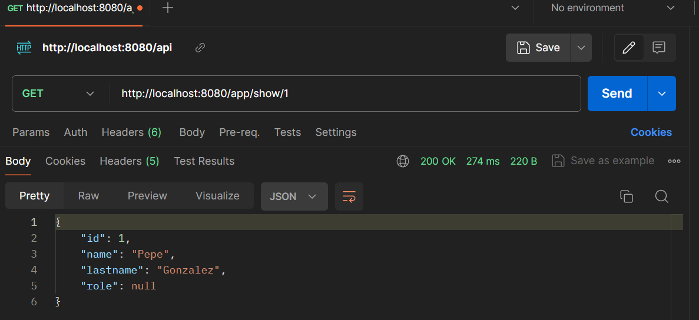
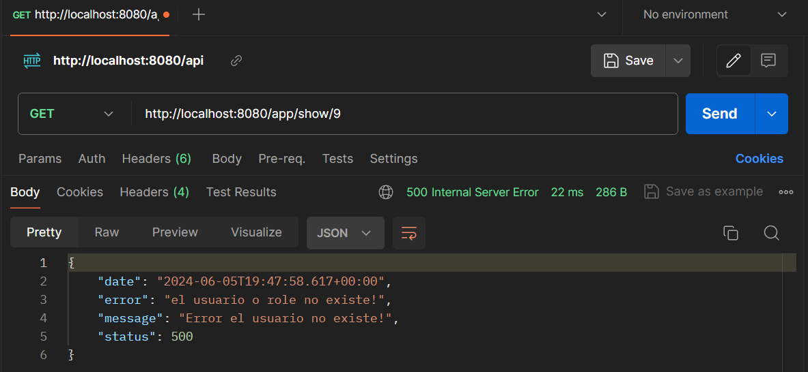

# Manejador de Excepciones-Spring
## Descripción del proyecto

Este proyecto manejamos las peticions `HTTP` para mostrar las excepciones personalizadas.

## Características

- **Spring MVC**: Para la gestión de solicitudes y la lógica del controlador.
- **Inyeccion de Dependencias**: Permite a una clase, obtener desde el contenedor, una referencia de otro objeto.
- **Maven**: Para la gestión de dependencias.
- **Spring Boot**: Para facilitar la configuración y el despliegue de la aplicación.
- **Postman**: Facilita las peticiones HTTP, para crear APIs.


## Recursos
El proyecto esta creado con las siguientes tecnologías, las primeras 3 se obtienen
al momento de crear el proyecto.


| Plugin                |
|-----------------------|
| Spring Web            | 
| Spring Boot DevTools  | 
| Spring Boot Actuator  | 


## Uso de Postman

**GET**
```sh
http://localhost:8080/app/show/1
```



**Manejando el error**
```sh
http://localhost:8080/app/show/9
```



